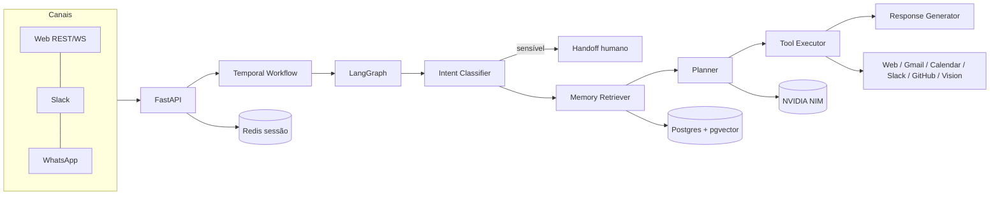

# Arquitetura

```mermaid
flowchart LR
    subgraph Canais
        W[Web REST/WS] --- S[Slack] --- WA[WhatsApp]
    end
    Canais --> API[FastAPI]
    API --> T[Temporal Workflow]
    T --> G[LangGraph]
    G --> IC[Intent Classifier]
    IC -->|sensível| H[Handoff humano]
    IC --> MR[Memory Retriever]
    MR --> P[Planner]
    P --> TE[Tool Executor]
    TE --> RG[Response Generator]
    P --> LLM[(NVIDIA NIM)]
    MR --> PG[(Postgres + pgvector)]
    API --> R[(Redis sessão)]
    TE --> Tools[Web / Gmail / Calendar / Slack / GitHub / Vision]
```

Troca de LLM: implemente `LLMProvider` (`app/llm/base.py`) e registre em `app/llm/__init__.py`.
